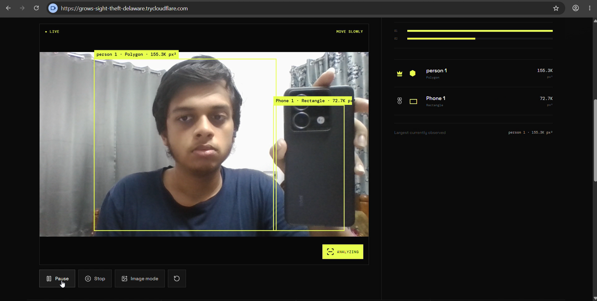
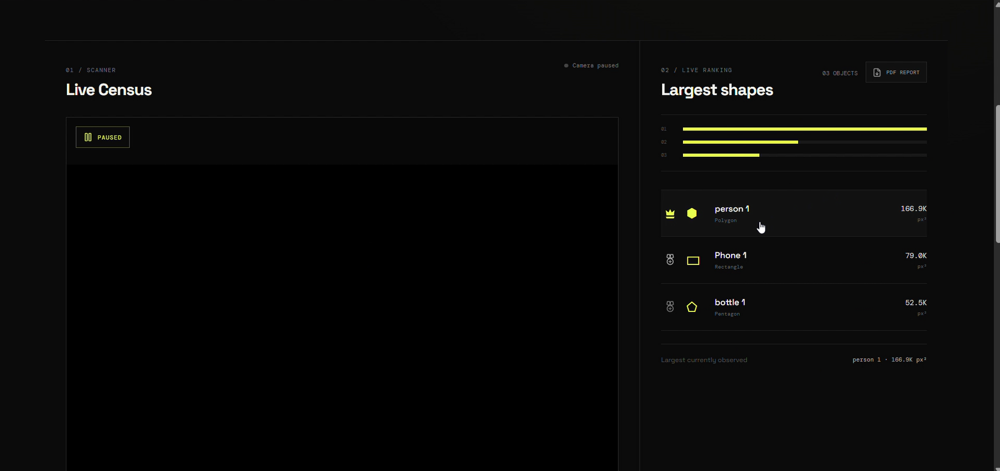
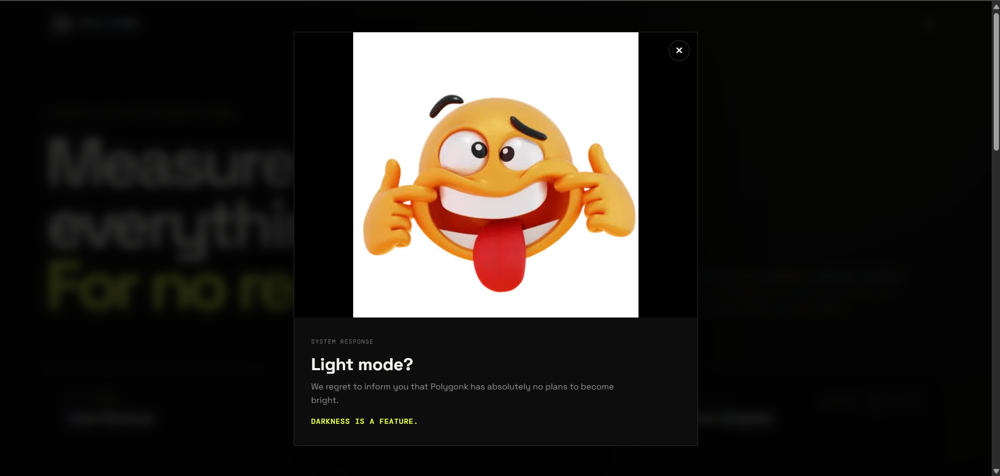
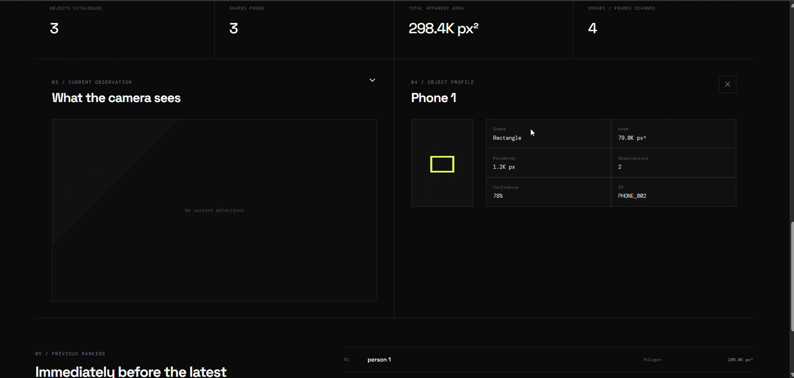
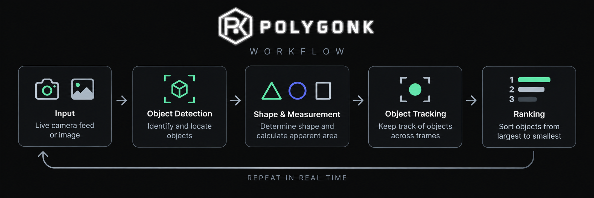

# POLYGONK 🎯


## Basic Details
### Team Name: The One


### Team Members
- Team Lead: Jairaj R - College of Engineering Trivandrum

### Project Description
Polygonk lets you point a camera at any scene and discover the objects around you, the shapes they resemble, the space they occupy, and how they rank against each other. It keeps track of each object as you explore, turning everyday scenes into their own little geometric census.

### The Problem (that doesn't exist)
Nobody knows which object in a room is the biggest when measured by its visible area in pixels. There is no standard way to settle these extremely important disputes.

### The Solution (that nobody asked for)
Polygonk scans the scene, identifies and tracks each object, measures its apparent area, determines its shape, and ranks everything from largest to smallest. Now, every object can finally know where it stands.

## Technical Details
### Technologies/Components Used

For Software:
- **Languages:** JavaScript, Python, CSS
- **Frameworks:** React, FastAPI
- **Libraries:** OpenCV, Ultralytics YOLO, jsPDF, Lucide React
- **Tools:** Vite, Git, GitHub, VS Code

For Hardware:
- **Main Components:** Laptop/PC, webcam or smartphone camera
- **Specifications:** Any device capable of running a modern web browser and accessing a camera
- **Tools Required:** No dedicated hardware required

### Implementation

For Software:

# Installation

```bash
git clone https://github.com/jairajrenjith/polygonk.git
cd polygonk
npm install
```

```bash
cd backend
pip install -r requirements.txt
```

# Run

Start the backend:

```bash
cd backend
uvicorn main:app --reload
```

In a new terminal, start the frontend:

```bash
cd frontend
npm run dev
```

Open the local URL shown by Vite in your browser.

**For mobile access:**

```bash
npm run build
npm run preview -- --host=0.0.0.0
```

Then expose the preview server using Cloudflare Tunnel:

```bash
cloudflared tunnel --protocol http2 --url http://localhost:4173
```

Open the generated `https://*.trycloudflare.com` URL on your mobile device.

### Project Documentation
For Software:

# Screenshots

*Live camera view showing detected objects, labels, shapes, and apparent area.*


*Geometric census ranking objects from largest to smallest based on apparent area.*


*The system's response when attempting to switch from the dark interface to light mode.*


*Detailed information displayed when selecting an object from the ranking.*

# Diagrams

*Workflow showing how an image or camera frame is processed and turned into a geometric census.*


### Project Demo
# Video
[Add your demo video link here]

*Demonstration of Polygonk detecting, tracking, measuring, and ranking objects in real time.*


## Team Contributions
- Jairaj R : Project development, implementation, and integration

---
Made with ❤️ at TinkerHub Useless Projects 


